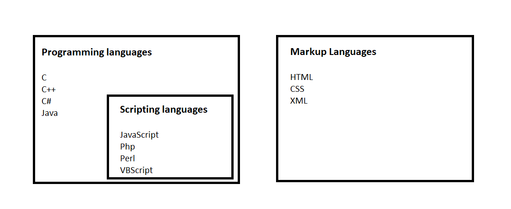

## What is JavaScript?

JavaScript was initially created to **"make webpages alive"**.

The programs in this language are called scripts. They can be written right in the HTML and execute automatically as the page 
loads.
Scripts are provided and executed as a plain text. They don't need a special preparation or a compilation to run.
In this aspect, JavaScript is very different from another language called Java.
 

> When JavaScript was created, it initially had another name: "LiveScript". But Java language was very popular at that time, 
> so it was decided that positioning a new language with a similar name of Java would help.
> As it evolved, JavaScript became a fully independent language, with its own specification called [ECMAScript](https://github.com/shravankb/ECMAScript-Specifications), 
> and it has no relation to Java at all.

 
 

JavaScript is a scripting language; 
- that allows you to implement complex features on web pages.
- 3rd Main layer of Web Technology
- Programming language for the WEB
- Updates and changes both HTML and CSS

Note:  **Scripting language & Programming language**

- Scripting languages are rather interpreted and not compiled; Programming languages are compiled.
- All Scripting languages are Programming languages

At present, JavaScript can execute not only in the browser, but also on the server, or actually on any device where 
exists a special program called the JavaScript engine.

Different engines have different "codenames", for example:

- V8 --> in Chrome and Opera.
- Gecko --> in Firefox.
- Chakra --> in Microsoft Edge

Engines are complicated. But the basics are easy.

1. The script is written and distributed as a plain text (can be compressed/optimized by so-called 
"javascript minifiers").
2. The engine (embedded if it's a browser) reads the script ("parses") and converts ("compiles") it 
to the machine language.
3. And then it runs, pretty fast.

The engine applies optimizations on every stage of the process. It even watches the script as it runs, analyzes the data 
which flows through it and applies optimizations to the machine-code basing on that knowledge.

### What can in-browser JavaScript do?

The modern JavaScript is a "safe" programming language. It does not provide low-level access to memory or CPU, because it 
was initially created for browsers which do not require it.

The capabilities greatly depend on the environment which runs JavaScript. For instance, Node.JS supports functions that 
allows JavaScript to read/write arbitrary files, perform network requests etc.

In-browser JavaScript can do everything related to webpage manipulation, interaction with the user and the webserver.

For instance, in-browser JavaScript is able to:

- Add new HTML to the page, change the existing content, modify styles.
- React on user actions, run on mouse clicks, pointer movements, key presses.
- Send requests over the network to remote servers, download and upload files (so-called AJAX and COMET technologies).
- Get and set cookies, ask questions to the visitor, show messages.
- Remember the data on the browser side ("local storage").

**[ :back: Back to Table of Content](https://github.com/shravankb/pre-requisite-nodejs)**